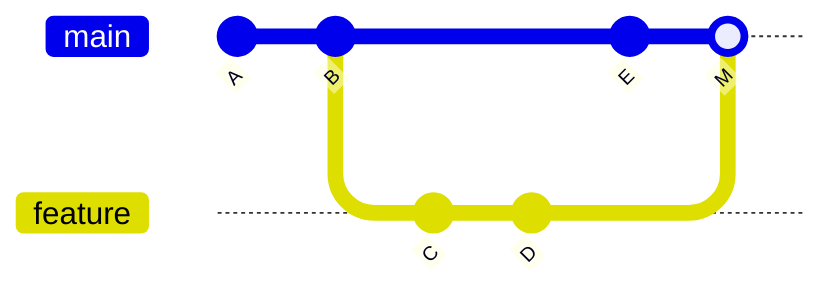

# Branching and merging

> **A branch is a pointer.** Everything difficult here is about what happens
> when two pointers have diverged and you want one history again.

---

## 1 · Three ways to combine



| | Fast-forward | Merge commit | Rebase |
|---|---|---|---|
| **When possible** | Target hasn't moved | Always | Always |
| **New commit?** | None | One, with two parents | New copies of each commit |
| **History shape** | Straight line | Branching, then joining | Straight line |
| **Preserves original hashes** | Yes | Yes | **No** |
| **Shows that a branch existed** | No | **Yes** | No |
| **Safe on shared branches** | Yes | Yes | **No** |

### Fast-forward

If `main` has not moved since you branched, git can just slide the pointer
forward. **No merge commit, no possible conflict.**

```bash
git merge feature            # fast-forwards when it can
git merge --no-ff feature    # force a merge commit anyway
```

**`--no-ff` is worth knowing:** it keeps a visible record that a feature branch
existed, which some teams want for auditability.

### Merge

Creates a commit with **two parents**. Nothing is rewritten; both histories
survive exactly as they were.

### Rebase

Replays your commits on top of the target, **creating new commits with new
hashes**.

```bash
git rebase main              # move my branch onto the current main
```

> **Rebase does not move commits — it copies them.** The originals stay in the
> object store until gc, which is why the reflog can undo a bad rebase. It is
> also why the hashes change, and therefore why rebasing shared history is
> destructive: your teammate's copy and yours are now different objects.

---

## 2 · The rule

> **Rebase your own unpushed work. Merge everything else.**

| Situation | Do |
|---|---|
| My local branch is behind `main` | **Rebase** — keeps history linear |
| Tidying my commits before a PR | **Rebase -i** — squash the "wip" noise |
| Bringing a reviewed feature into `main` | **Merge** (often squash-merge) |
| Someone else has the branch too | **Merge.** Never rebase |
| `main` into my long-lived branch | Merge, or rebase if you are the only one on it |

**The Golden Rule of Rebasing:** *never rebase commits that exist outside your
repository.* If it has been pushed and anyone may have pulled it, merge.

---

## 3 · Conflicts

**A conflict is not an error.** It means two changes touched the same region and
git will not guess.

```
<<<<<<< HEAD
the version on the branch you are ON
=======
the version being merged IN
>>>>>>> feature
```

```bash
# 1. see what conflicts
git status

# 2. edit the files -- remove ALL the markers
# 3. mark resolved
git add <file>

# 4. finish
git commit          # for merge
git rebase --continue   # for rebase
```

| Escape hatch | Command |
|---|---|
| Abandon a merge | `git merge --abort` |
| Abandon a rebase | `git rebase --abort` |
| Take their whole file | `git checkout --theirs <file>` |
| Take my whole file | `git checkout --ours <file>` |

> **During a rebase, "ours" and "theirs" are reversed from what you expect.**
> Rebase replays *your* commits onto the target, so the target is "ours" and
> your commit is "theirs". This catches everyone once — check with
> `git status` rather than guessing.

**`rerere`** (reuse recorded resolution) is worth enabling if you rebase long
branches repeatedly — git remembers how you resolved a conflict and reapplies it:

```bash
git config --global rerere.enabled true
```

---

## 4 · Branching strategies

| Strategy | Branches | Good for | Cost |
|---|---|---|---|
| **Trunk-based** | `main` + very short-lived | CI/CD, frequent deploys | Needs feature flags and good tests |
| **GitHub flow** | `main` + feature branches, PR to merge | Most teams, web services | Little; the sensible default |
| **Git flow** | `main`, `develop`, `feature/*`, `release/*`, `hotfix/*` | Versioned software with support branches | **Heavy** — often more ceremony than value |
| **Release branches** | `main` + `release/x.y` | Software you must patch old versions of | Cherry-picking between branches |

> **Most teams should use GitHub flow and most who use git flow do not need
> it.** Git flow was designed for shipping versioned desktop software with
> parallel supported releases. If you deploy from `main` several times a week,
> `develop` is an extra merge that buys nothing.

**Long-lived branches are the real problem**, whatever the strategy. A branch
open for three weeks accumulates conflicts superlinearly. **Merge `main` in
often, or keep branches under a few days.**

---

## 5 · Squash, merge, or rebase on the PR button

GitHub and GitLab offer three merge buttons. They are not interchangeable.

| Button | Result on `main` | Use when |
|---|---|---|
| **Create a merge commit** | Every branch commit, plus a merge commit | You want the full development record |
| **Squash and merge** | **One commit** containing everything | **The usual default** — the branch's "wip" commits are noise |
| **Rebase and merge** | Each commit replayed, no merge commit | You curated the commits and each is meaningful |

> **Squash-merge is the right default for most teams.** It makes `main` a clean
> list of features, each revertible in one command, and it stops
> "fix typo" appearing in the permanent history. The trade-off: you lose the
> fine-grained history of how the feature was built — which is usually not worth
> preserving.

---

## 6 · Interview questions

| Question | Answer |
|---|---|
| ⭐ "Merge or rebase?" | Rebase my own unpushed work to keep history linear; merge anything shared. Rebase copies commits with new hashes, so rebasing pushed history makes everyone else's copies diverge. |
| ⭐ "What is a fast-forward?" | When the target hasn't moved since you branched, git slides the pointer forward — no merge commit and no possible conflict. `--no-ff` forces one anyway if you want the branch recorded. |
| "What actually causes a conflict?" | Two changes to the same region of the same file with no common resolution. Git marks the region and refuses to guess. It is not an error state — abort or resolve. |
| ⭐ "Why are ours/theirs swapped in a rebase?" | Because rebase replays your commits onto the target, so the target is the current checkout — "ours" — and your commit is being applied — "theirs". |
| "Which merge button?" | Squash by default: `main` becomes one clean commit per feature, each revertible. Merge commit if the branch history matters. Rebase-and-merge only if every commit was curated. |
| "Git flow or trunk-based?" | Trunk-based or GitHub flow for anything deployed continuously. Git flow suits versioned software with supported old releases; using it for a web service is ceremony without benefit. |

---

## Stop condition

You have this when you can:

1. explain what fast-forward, merge and rebase each do to the graph,
2. state the golden rule of rebasing and why hashes change,
3. resolve a conflict and abort one,
4. explain the ours/theirs inversion during rebase, and
5. choose a merge button with a reason.
