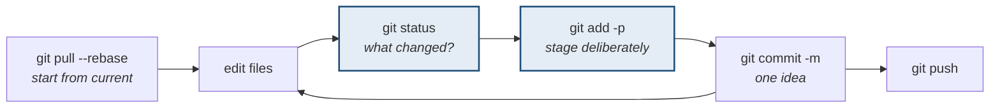

# Everyday git

> **Twelve commands cover about 95% of real usage.** The rest of git exists for
> the times something has gone wrong — that is [undoing & recovery](undoing.html).

---

## 1 · The loop



**The two highlighted steps are what separate careful users from the rest.**
`status` constantly, and `add -p` so a commit contains one idea rather than
everything you happened to touch.

---

## 2 · The twelve

| Command | Does | Touches |
|---|---|---|
| `git status` | Shows the state of all four areas | nothing |
| `git add <file>` | Stage a file | working → staging |
| `git add -p` | Stage **hunk by hunk**, interactively | working → staging |
| `git commit -m "…"` | Record the staged snapshot | staging → local |
| `git log --oneline --graph` | See the actual shape of history | nothing |
| `git diff` | Working vs staged | nothing |
| `git diff --staged` | Staged vs last commit | nothing |
| `git switch <branch>` | Change branch | local → working |
| `git switch -c <branch>` | Create and change | writes a ref |
| `git fetch` | Update your cache of the remote | remote → `origin/*` |
| `git pull --rebase` | Fetch, then replay your commits on top | remote → local → working |
| `git push` | Send your commits | local → remote |

---

## 3 · `git status` is the most important command

**Read it, do not skim it.** It tells you which of the four areas hold what:

```
On branch main
Your branch is ahead of 'origin/main' by 2 commits.      <- local vs remote

Changes to be committed:                                 <- STAGING AREA
        modified:   a.txt

Changes not staged for commit:                           <- WORKING DIRECTORY
        modified:   b.txt

Untracked files:                                         <- git does not know these
        c.txt
```

Four distinct states in one output. **Most "git is confusing" moments dissolve
when you read status carefully** — the answer to "why didn't my change get
committed?" is nearly always visible there.

`git status -sb` gives the compact form once you know the long one.

---

## 4 · Staging deliberately

```bash
git add -p
```

Git shows each change and asks:

```
Stage this hunk [y,n,q,a,d,s,e,?]?
   y - yes        n - no          q - quit
   s - SPLIT this hunk into smaller ones
   e - edit the hunk manually
```

> **`s` is the one worth knowing.** You fixed a bug and reformatted three lines
> in the same function. Splitting lets the bug fix be one commit and the
> formatting another — so a reviewer can see the fix without noise, and a
> `revert` later undoes only what it should.

---

## 5 · Writing a commit message

```
Short summary in the imperative, under ~50 chars

Why this change exists, and what it does that is not obvious
from the diff. Wrap at ~72. The diff already says WHAT changed;
this paragraph is for WHY.

Fixes #123
```

| Do | Don't |
|---|---|
| "Fix timeout on slow connections" | "fixes" |
| Say **why**, since the diff shows what | Restate the diff in prose |
| Imperative mood — "add", not "added" | Mix five unrelated changes |
| Reference the issue | "wip", "asdf", "final v2" |

> **The audience is you in six months, mid-incident, running `git log -S` to
> find when a line appeared.** Write for that person. "fix" tells them nothing;
> "fix timeout because the retry budget was per-request not per-client" tells
> them everything.

---

## 6 · pull, fetch, and pull --rebase

```
git fetch          updates origin/* ONLY. Never touches your work. Always safe.
git pull           = fetch + merge     -> may create a merge commit
git pull --rebase  = fetch + rebase    -> replays your commits on top, linear
```

> **`git pull --rebase` should usually be your default**, and you can make it
> one: `git config --global pull.rebase true`. Plain `pull` creates a merge
> commit every time your local and remote have both moved, which fills history
> with "Merge branch 'main' of github.com…" noise that records nothing useful.
>
> **The exception:** if you have already pushed the commits being replayed,
> rebasing rewrites them. In that case merge.

**`git fetch` is the safest command in git.** It only updates your cached view
of the remote. When unsure what has changed upstream, fetch and then look —
never a reason not to.

---

## 7 · Stash

```bash
git stash              # park tracked changes
git stash -u           # include untracked files
git stash list
git stash pop          # reapply the most recent, and drop it
git stash apply        # reapply, but KEEP it in the list
git stash drop
```

> **`git stash` without `-u` leaves untracked files behind**, which surprises
> people mid-`pull`. If you created new files, use `-u`.
>
> **A stash is not a commit and not a branch** — it is easy to forget one and
> lose track. For anything you care about, a throwaway branch (`git switch -c
> wip`) is safer and visible in `git branch`.

---

## 8 · `.gitignore`

```
node_modules/
dist/
.env                 <- CREDENTIALS. This one matters most.
*.log
.DS_Store
```

> **`.gitignore` only affects files git is not already tracking.** Adding a file
> to `.gitignore` after committing it does nothing — it stays tracked. To stop
> tracking but keep it on disk:
>
> ```bash
> git rm --cached .env
> ```
>
> **And note what that does not do: the file is still in every past commit.** A
> credential that was ever committed is compromised and must be rotated —
> removing it from the current tree does not remove it from history, and history
> is public if the repo is.

---

## 9 · Interview questions

| Question | Answer |
|---|---|
| ⭐ "fetch vs pull?" | Fetch updates your cached `origin/*` refs and touches nothing else — always safe. Pull is fetch plus merge (or rebase with `--rebase`), so it changes your branch and working directory. |
| ⭐ "Why `pull --rebase`?" | Plain pull creates a merge commit whenever both sides moved, filling history with noise that records nothing. Rebase replays your commits on top for a linear history. Not for commits you already pushed. |
| "What is the staging area for?" | Choosing precisely what goes into a commit. `git add -p` lets one messy working directory become several clean, single-purpose commits — which makes review and revert work properly. |
| ⭐ "You committed a `.env` file." | Rotate the credential first — it is compromised the moment it is pushed. Removing it from the current tree with `git rm --cached` does not remove it from history; that needs a history rewrite, and by then assume it has been scraped. |
| "What makes a good commit message?" | Imperative summary under about 50 characters, then why the change exists. The diff already says what changed; the message is for the person debugging in six months. |

---

## Stop condition

You have this when you can:

1. read `git status` and name which area each section describes,
2. use `add -p` and split a hunk,
3. explain why fetch is always safe,
4. say when `pull --rebase` is wrong, and
5. explain why `.gitignore` does not untrack an already-committed file.
