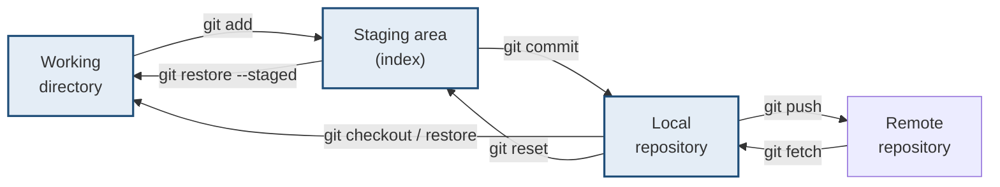
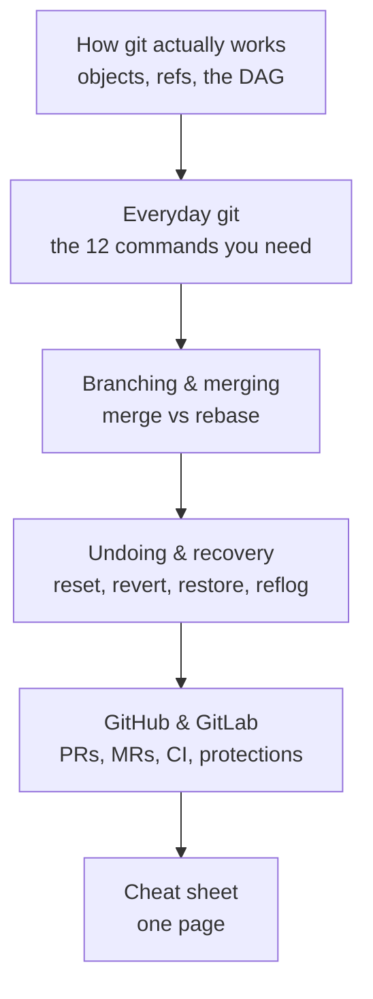

# Git Handbook

> **Git feels arbitrary because most people learn it as a list of commands.**
> `add`, `commit`, `push`, and then one day something goes wrong and none of the
> memorised commands apply.
>
> **There is a model underneath, and it is small.** Learn it and the commands
> stop being magic incantations — they become moves between four places.

---

## 1 · The whole model in one diagram

**Four places. Almost every command moves something between two of them.**
When a command confuses you, the question is always: *which two areas does this
touch, and in which direction?*

| Area | Is | Lives in |
|---|---|---|
| **Working directory** | The files you can see and edit | Your folder |
| **Staging area (index)** | What will go into the next commit | `.git/index` |
| **Local repository** | Your committed history | `.git/objects` |
| **Remote** | The shared copy | GitHub / GitLab |

> **The staging area is the part that trips people up**, and it is the part that
> makes git better than the alternatives: you choose *precisely* what goes into
> a commit, rather than committing everything you happened to change.

---

## 2 · What this handbook is not

It is not a command reference — `git help` and the man pages already exist and
are better at that. **This is the model, the state transitions, and the recovery
paths**, because those are what a reference cannot give you.

Every claim about git's behaviour here was **executed against a real repository**
and the output is real. Where a diagram shows what a command does, that is what
it actually did.

---

## 3 · Reading order

| If you have | Read |
|---|---|
| **20 minutes** | [The cheat sheet](cheatsheet.html), and nothing else |
| **An hour** | [How git actually works](mental-model.html) then the cheat sheet |
| **You broke something now** | [Undoing & recovery](undoing.html) — start at §1 |
| **You are learning properly** | Straight through, in the order above |

---

## 4 · The three sentences that prevent most problems

> **1. A commit is a snapshot, not a diff.** Git stores the whole tree each
> time, deduplicated by content hash. Diffs are computed when you ask for them,
> not stored.

> **2. A branch is a movable pointer to one commit — nothing more.** It is a
> file containing 40 characters. Creating one is free; deleting one deletes no
> data.

> **3. Almost nothing is ever really deleted until `gc` runs.** The
> [reflog](undoing.html#5--reflog--the-undo-history-for-your-undo) remembers
> where HEAD has been, usually for 90 days. **If you think you destroyed work,
> you probably have not.**

---

## 5 · Companion handbooks

| Repo | Covers |
|---|---|
| [dsa-handbook](https://SAGARCHRY0777.github.io/dsa-handbook/) | Coding interviews — patterns and worked solutions |
| [system-design-handbook](https://SAGARCHRY0777.github.io/system-design-handbook/) | The system design round |
| [llm-handbook](https://SAGARCHRY0777.github.io/llm-handbook/) | LLM systems — RAG, evaluation, serving |

Start with [how git actually works](mental-model.html).
