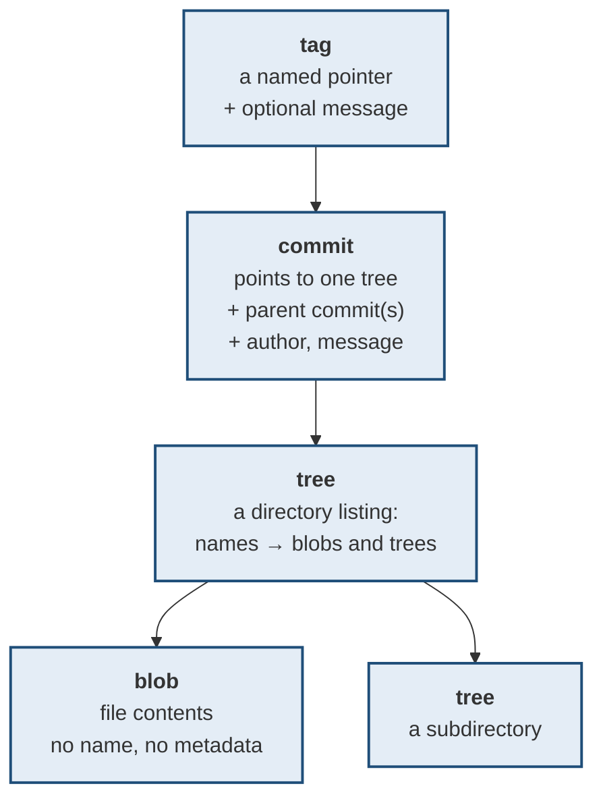
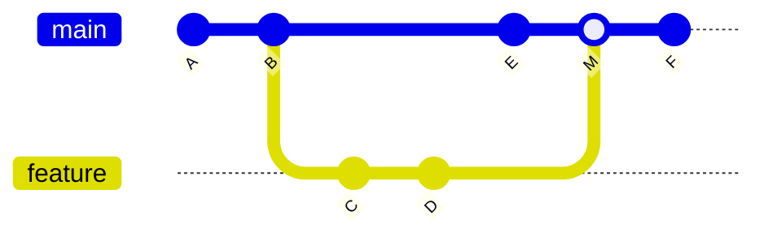

# How git actually works

> **Git is a content-addressed key-value store with a commit graph on top.**
> That is the whole thing. Once you can see the objects, every command becomes
> readable.

**Every hash and every output below came from an actual repository**, not from
memory.

---

## 1 · Four object types



| Object | Holds | Does **not** hold |
|---|---|---|
| **blob** | File contents | The filename, permissions, or any history |
| **tree** | Names → blobs/trees, plus modes | Contents |
| **commit** | One tree + parents + author + message | Any diff |
| **tag** | A pointer to an object, plus a message | — |

---

## 2 · Watch it happen

A fresh repository, one file containing `hello`:

```
$ echo "hello" > a.txt
$ git hash-object a.txt
ce013625030ba8dba906f756967f9e9ca394464a
```

**That hash is computed from the content alone**, before anything is committed —
and it is the same on every machine on earth for the same bytes. That is what
"content-addressed" means.

```
$ git add a.txt
$ git ls-files -s
100644 ce013625030ba8dba906f756967f9e9ca394464a 0   a.txt
```

**The staging area is literally a list of blob hashes with filenames.** Adding a
file writes the blob into the object store and records the hash here.

```
$ git commit -m "first"
$ git cat-file -p HEAD
tree 2e81171448eb9f2ee3821e3d447aa6b2fe3ddba1
author T <t@t> 1788714639 +0530
committer T <t@t> 1788714639 +0530

first
```

**A commit is five lines of text.** A tree hash, an author, a committer, and a
message. Note what is absent: **no diff, and no filename**.

```
$ git cat-file -p HEAD^{tree}
100644 blob ce013625030ba8dba906f756967f9e9ca394464a    a.txt

$ git cat-file -p HEAD:a.txt
hello
```

**The tree supplies the name; the blob supplies the content.** That separation
is why renaming a file creates no new blob — the content is unchanged, so only
the tree differs.

```
$ git cat-file -t HEAD          -> commit
$ git cat-file -t HEAD^{tree}   -> tree
$ git cat-file -t HEAD:a.txt    -> blob
```

---

## 3 · Three consequences that matter

### A commit is a snapshot, not a diff

Every commit points to a **complete tree** of the project. Git does not store
"lines changed"; it computes those on demand when you ask for a diff.

> **This is why `git checkout` of an old commit is fast** regardless of how much
> history there is — it is one tree read, not a replay of a thousand patches.
> And it is why identical files across a thousand commits cost one blob: same
> content, same hash, stored once.

### A branch is a 40-character file

```
.git/refs/heads/main   ->  f55234f1a...
```

That is all a branch is. **Creating one writes 41 bytes. Deleting one deletes no
data** — it only removes a pointer, and the commits remain reachable through the
reflog until garbage collection.

**HEAD** is one more pointer, usually pointing *at a branch* rather than at a
commit:

```
.git/HEAD  ->  ref: refs/heads/main
```

**"Detached HEAD" simply means HEAD points straight at a commit** instead of at
a branch. Nothing is broken; there is just no branch to move when you commit,
which is why new commits there become unreachable if you leave.

### History is a DAG, not a line



Each commit records its **parents**. A normal commit has one; a merge commit has
two or more; the first commit has none. **The graph is the history** — branches
are just labels on nodes.

---

## 4 · Why this makes commands obvious

| Command | What it does to objects |
|---|---|
| `git add` | Writes blobs; updates the index |
| `git commit` | Writes a tree from the index, writes a commit pointing at it, moves the branch |
| `git branch x` | Writes 41 bytes to `refs/heads/x` |
| `git checkout x` | Points HEAD at `x`; rewrites the working directory from its tree |
| `git merge` | Writes a commit with **two** parents |
| `git rebase` | Writes **new** commits with different parents; the originals still exist |
| `git reset` | **Moves the branch pointer.** Optionally also the index and working directory |
| `git cherry-pick` | Applies one commit's change as a **new** commit |

> **Notice that `rebase` and `cherry-pick` create new objects rather than moving
> old ones.** That is why a rebased commit has a different hash, and why
> rebasing shared history forces everyone else to reconcile — their commits and
> yours are now genuinely different objects with the same content.

---

## 5 · The `.git` directory

```
.git/
  HEAD              -> which branch you are on
  index             -> the staging area
  objects/          -> every blob, tree, commit, tag
  refs/heads/       -> local branches
  refs/remotes/     -> your last-known state of remote branches
  refs/tags/        -> tags
  logs/HEAD         -> the REFLOG: everywhere HEAD has been
  config            -> this repo's settings
```

**`refs/remotes/origin/main` is not the remote.** It is your *cached snapshot*
of it, updated only by `fetch` (or `pull`, which fetches then merges).

> **This explains the most common confusion in git:** `origin/main` can be
> stale. If a colleague pushed five minutes ago and you have not fetched, your
> `origin/main` still points at the old commit. **`git fetch` is always safe** —
> it only updates that cache and touches nothing else.

---

## 6 · Interview questions

| Question | Answer |
|---|---|
| ⭐ "What is a commit?" | An object holding one tree hash, its parent commit hashes, author/committer, and a message. It is a full snapshot; diffs are computed on demand, never stored. |
| ⭐ "What is a branch?" | A file containing a commit hash. Creating and deleting branches is essentially free, and deleting one removes no commits. |
| "How does git deduplicate?" | Content addressing. An object's name is the SHA-1 of its content, so identical content across any number of commits is stored once. |
| ⭐ "Why does rebase change hashes?" | A commit's hash covers its parents, so replaying it onto a new parent produces a different object. The original still exists until gc, which is why the reflog can recover it. |
| "What is detached HEAD?" | HEAD points directly at a commit rather than at a branch. Committing there works, but no branch moves — so those commits become unreachable when you leave, and you recover them from the reflog. |
| ⭐ "Difference between `origin/main` and `main`?" | `main` is your branch. `origin/main` is your **cached** view of the remote from your last fetch, and it can be stale. Fetch updates the cache and changes nothing else. |

---

## Stop condition

You have this when you can:

1. name the four object types and what each stores,
2. explain why a commit is a snapshot rather than a diff,
3. say what a branch physically is,
4. explain why rebase produces different hashes, and
5. explain why `origin/main` can be out of date.
