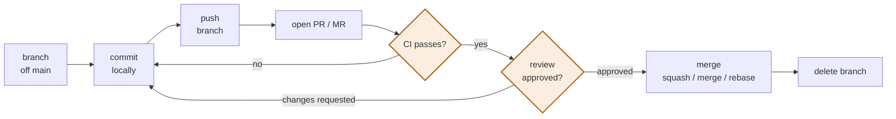

# GitHub and GitLab

> **Git is the version control system. GitHub and GitLab are products built on
> top of it.** Nothing on this page is git — it is collaboration workflow,
> review, CI, and permissions.

---

## 1 · The same ideas, different names

| Concept | GitHub | GitLab |
|---|---|---|
| Proposing a change | **Pull request** | **Merge request** |
| CI config file | `.github/workflows/*.yml` | `.gitlab-ci.yml` |
| CI compute | Runners (hosted or self-hosted) | Runners (hosted or self-hosted) |
| Secrets | Actions secrets & variables | CI/CD variables |
| Container registry | GitHub Packages | Container Registry (built in) |
| Static hosting | GitHub Pages | GitLab Pages |
| Required reviewers | `CODEOWNERS` | `CODEOWNERS` (premium for some rules) |
| Issue tracking | Issues + Projects | Issues + Boards + Epics |
| Access control | Org / team / repo roles | Group / subgroup / project |

> **"Pull request" is arguably the worse name.** You are *requesting that they
> merge* your branch. GitLab's "merge request" describes it accurately. Same
> object, though.

---

## 2 · The review workflow



**A good PR is small.** Review quality falls off a cliff past a few hundred
lines — reviewers switch from reading to skimming, and skimmed reviews approve
bugs. **If a change must be large, split it into a stack of small PRs.**

**Write the description for the reviewer, not the record:** what changed, why,
and what you want them to look hardest at. "Fixes #123" is not a description.

---

## 3 · Branch protection — what to actually turn on

| Setting | Why |
|---|---|
| **Require a PR before merging** | No direct pushes to `main` |
| **Require status checks to pass** | CI is a gate, not a suggestion |
| **Require branches up to date** | Prevents "passed on stale base, breaks on merge" |
| **Require ≥1 approval** | Somebody read it |
| **Dismiss stale approvals on new commits** | Approval covered the code that was reviewed |
| **Require conversation resolution** | Comments cannot be silently ignored |
| **Restrict force-push** | The one that saves you |
| **Require signed commits** | Only where you actually need provenance |

> **"Require branches up to date" is the one people skip and then get bitten
> by.** Your PR passed CI against a two-day-old `main`. Someone else merged an
> incompatible change. Yours merges green and `main` breaks. This setting forces
> a re-run against current `main`.

---

## 4 · CI side by side

**The same pipeline in both systems.**

**GitHub Actions** — `.github/workflows/build.yml`:

```yaml
name: Build
on:
  push:
    branches: [main]
  pull_request:

jobs:
  test:
    runs-on: ubuntu-latest
    steps:
      - uses: actions/checkout@v4
      - uses: actions/setup-node@v4
        with:
          node-version: "20"
          cache: npm
      - run: npm ci
      - run: npm test
```

**GitLab CI** — `.gitlab-ci.yml`:

```yaml
stages: [test]

test:
  stage: test
  image: node:20
  cache:
    key: "$CI_COMMIT_REF_SLUG"
    paths: [node_modules/]
  script:
    - npm ci
    - npm test
  rules:
    - if: $CI_COMMIT_BRANCH == "main"
    - if: $CI_PIPELINE_SOURCE == "merge_request_event"
```

| | GitHub Actions | GitLab CI |
|---|---|---|
| Unit of work | **job** in a workflow | **job** in a stage |
| Ordering | `needs:` between jobs | `stages:` are sequential |
| Reuse | Marketplace **actions** | `include:` and `extends:` |
| Container-native | Optional (`container:`) | **Default** — every job names an image |
| Config location | Many files in `.github/workflows/` | Usually one `.gitlab-ci.yml` |
| Self-hosting | Self-hosted runners | Runners; **the whole platform can self-host** |

> **The clearest structural difference:** GitLab CI is container-first — every
> job declares an image and runs inside it. GitHub Actions is
> step-and-marketplace-first, where you compose published actions. Neither is
> better; they reward different habits.

---

## 5 · Choosing

| Want | Pick |
|---|---|
| Open source, discoverability, contributors | **GitHub** — the network effect is the product |
| Self-hosted everything, one tool for the lifecycle | **GitLab** — it is a complete DevOps platform |
| The largest ecosystem of ready-made CI steps | **GitHub** — the Actions marketplace |
| Built-in container registry, security scanning, environments | **GitLab** — included rather than assembled |
| Enterprise with strict data residency | **GitLab self-managed** |
| A portfolio recruiters will look at | **GitHub** — this is where they look |

> **For a public portfolio the answer is GitHub, and it is not close.** Not
> because the product is better, but because that is where people already are.

**They interoperate.** Both are git, so mirroring one to the other is
straightforward, and moving is a push away — the repository is portable even
when the CI config and issues are not.

---

## 6 · Making a repo worth finding

**Most repositories are invisible, and the reasons are fixable in minutes.**

| Do this | Why |
|---|---|
| **Add topics** | This is how GitHub search finds repos. No topics ≈ unfindable |
| **One-line description** | It is the only text in search results |
| **Set the homepage URL** | The About box link, if there is a live site |
| **A README that opens with what it is and who it is for** | People decide in ten seconds |
| **Pin your best 6** | The profile shows pinned repos first |
| **Archive or hide dead repos** | Signal-to-noise: six good repos read better than forty-four with thirty-eight abandoned |
| **A profile README** | The repo named after your username renders on your profile |

> **Signal-to-noise is the thing people get wrong.** A visitor scans your
> profile for about fifteen seconds. Forty repos where most are course exercises
> reads as "student"; six polished ones read as "engineer". **Archiving is not
> deleting** — the code stays, it just stops competing for attention.

---

## 7 · Interview questions

| Question | Answer |
|---|---|
| ⭐ "PR vs MR?" | The same object with different names — GitHub's pull request and GitLab's merge request both propose merging a branch, gated by review and CI. |
| ⭐ "What branch protections would you set?" | Require a PR, passing checks, at least one approval, dismissal of stale approvals on new commits, and no force-push. And require branches be up to date, or a PR can pass against a stale base and break `main` on merge. |
| "Actions vs GitLab CI?" | Same model — jobs, dependencies, runners. GitLab is container-first: every job names an image. Actions is composition-first around a marketplace of reusable steps. GitLab bundles more of the lifecycle; GitHub has the bigger ecosystem. |
| "How do you keep PRs reviewable?" | Keep them small. Past a few hundred lines reviewers skim rather than read, and skimmed reviews approve bugs. Stack several small PRs instead of one large one. |
| "Squash, merge or rebase on merge?" | Squash by default, so `main` is one clean revertible commit per feature. Merge commit when the branch history matters; rebase-and-merge only when each commit was deliberately curated. |

---

## Stop condition

You have this when you can:

1. map PR/MR, Actions/GitLab CI and their config files,
2. name the protections you would enable and why "up to date" matters,
3. write an equivalent pipeline in both systems,
4. choose a platform for a stated goal, and
5. list what makes a repository findable.
