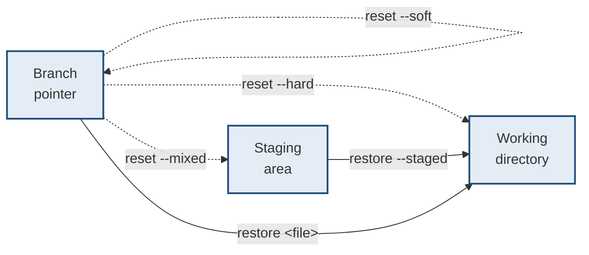
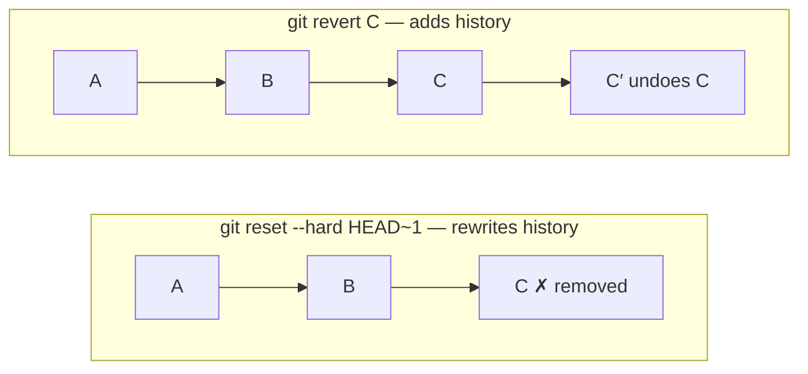

# Undoing and recovery

> **If you just broke something, start here.** §1 is a lookup table. Read the
> rest afterwards.

---

## 1 · "I did X, how do I undo it?"

| What happened | Do this |
|---|---|
| Edited a file, want the last committed version | `git restore <file>` |
| Staged a file, want it unstaged (keep edits) | `git restore --staged <file>` |
| Committed, want to change the message | `git commit --amend` |
| Committed, forgot a file | stage it, then `git commit --amend --no-edit` |
| Committed, want the commit gone but keep changes | `git reset --soft HEAD~1` |
| Committed, want the commit and changes gone | `git reset --hard HEAD~1` ⚠️ |
| **Pushed**, and need to undo it | `git revert <sha>` — **not** reset |
| Deleted a branch by mistake | `git reflog`, then `git branch <name> <sha>` |
| Reset --hard and lost commits | `git reflog`, then `git reset --hard <sha>` |
| Wrong branch — committed to `main` instead of a feature | see §6 |
| Merge went wrong, not committed yet | `git merge --abort` |
| Rebase went wrong, mid-rebase | `git rebase --abort` |
| Want a colleague's single commit | `git cherry-pick <sha>` |
| Need to park work briefly | `git stash` / `git stash pop` |
| Truly lost, nothing else worked | `git fsck --lost-found` |

> ⚠️ **The only genuinely destructive things** are `reset --hard` and `clean -fd`
> **on work that was never committed**. Everything committed is recoverable from
> the reflog for ~90 days.

---

## 2 · reset, revert, restore, checkout

**These four confuse everyone because their names do not say which area they
touch.** That is the only question that matters.



| Command | Moves branch? | Touches index? | Touches working dir? |
|---|---|---|---|
| `reset --soft` | **yes** | no | no |
| `reset --mixed` *(default)* | **yes** | **yes** | no |
| `reset --hard` | **yes** | **yes** | **yes** ⚠️ |
| `restore <file>` | no | no | **yes** |
| `restore --staged <file>` | no | **yes** | no |
| `revert <sha>` | **adds a commit** | — | — |

**Verified — the same starting point, the three reset modes:**

```
soft    HEAD moved back    staged: a.txt      working: clean
mixed   HEAD moved back    staged: clean      working: a.txt modified
hard    HEAD moved back    staged: clean      working: clean
```

> **Read that table as a ladder.** `--soft` moves only the pointer, so your work
> is sitting staged and ready to recommit. `--mixed` also clears the staging
> area, so the work is in your files but unstaged. `--hard` also overwrites your
> files — **the only one that can lose uncommitted work.**

### reset versus revert — the one that matters in a team



| | `reset` | `revert` |
|---|---|---|
| History | **Rewritten** | **Appended** |
| Safe on pushed commits | **No** | **Yes** |
| Needs force-push | Yes | No |
| Leaves an audit trail | No | Yes |

> **Rule: `reset` for local commits nobody has seen, `revert` for anything
> pushed.** Force-pushing a shared branch makes everyone else's history diverge,
> and the usual result is someone force-pushing the old version back and
> destroying your fix.

---

## 3 · Amend — and its one trap

```bash
git commit --amend                # change the message
git add forgotten.txt
git commit --amend --no-edit      # add a file, keep the message
```

**`--amend` does not edit a commit.** It creates a *new* commit with a new hash
and moves the branch. The original is orphaned but still in the reflog.

> **The trap: amending after pushing.** The remote has the old commit, you now
> have a different one, and the push is rejected. Amend only what you have not
> pushed — or accept that you need a force-push and that nobody else has pulled.

---

## 4 · Interactive rebase — cleaning up before you push

```bash
git rebase -i HEAD~4
```

```
pick   a1b2c3  add parser
squash d4e5f6  fix typo          <- fold into the one above
reword 7g8h9i  add tests         <- edit the message
drop   j0k1l2  debug logging     <- remove entirely
```

| Verb | Does |
|---|---|
| `pick` | Keep as-is |
| `reword` | Keep, edit the message |
| `squash` | Merge into the previous commit, combine messages |
| `fixup` | Like squash, but discard this message |
| `edit` | Stop so you can change the content |
| `drop` | Delete the commit |

> **Interactive rebase is for tidying your own unpushed work**, turning "wip",
> "wip 2", "fix" into one reviewable commit. **Never on shared history.**

**This environment note matters:** interactive rebase opens an editor, so it
cannot run in a non-interactive shell. Run it in a real terminal.

---

## 5 · Reflog — the undo history for your undo

**The single most valuable command in git, and the one most people never learn.**

```
$ git reflog
f55234f HEAD@{0}: reset: moving to f55234f
e93a576 HEAD@{1}: reset: moving to HEAD~1
f55234f HEAD@{2}: commit: third
...
```

**The reflog records every position HEAD has held** — every commit, checkout,
reset, merge and rebase — with a default expiry of about 90 days.

```bash
git reflog                        # find the sha you want back
git reset --hard <sha>            # go back to it
git branch rescue <sha>           # or park it on a new branch, safer
```

> **This is why "I lost my work" is almost always false.** A `reset --hard` that
> destroyed three commits did not delete them; it moved a pointer. The commits
> sit in `.git/objects` until garbage collection, and the reflog still knows
> their hashes.
>
> **The genuine exception:** changes never committed at all. The reflog tracks
> commits, so uncommitted edits wiped by `reset --hard` or `git clean -fd` are
> gone. **Commit early — even a bad commit is recoverable, an uncommitted edit
> is not.**

---

## 6 · Common situations, worked

### Committed to the wrong branch

```bash
git branch feature          # 1. label the commits where they are
git reset --hard origin/main   # 2. put main back where it belongs
git checkout feature        # 3. carry on
```

**Do step 1 first.** Creating the branch is what keeps the commits reachable
before you move `main`.

### Need to pull, but have local edits

```bash
git stash
git pull
git stash pop              # conflicts possible here -- resolve as usual
```

### Squash a messy branch into one commit

```bash
git reset --soft $(git merge-base HEAD main)
git commit -m "one clean commit"
```

**`--soft` back to where the branch diverged** leaves every change staged, ready
to commit once.

### Recover a deleted branch

```bash
git reflog | grep <branch-name>
git branch <branch-name> <sha>
```

### Truly lost — nothing in the reflog

```bash
git fsck --lost-found
```

Finds unreachable objects. Slow, ugly, and it has genuinely saved people.

---

## 7 · Force-push safely

```bash
git push --force-with-lease       # ✅
git push --force                  # ⚠️ never
```

> **`--force-with-lease` refuses to push if the remote has moved since your last
> fetch.** Plain `--force` overwrites unconditionally — including the commit a
> colleague pushed thirty seconds ago, which then exists nowhere.
>
> **Make it the default:** `git config --global alias.pushf "push --force-with-lease"`

---

## 8 · Interview questions

| Question | Answer |
|---|---|
| ⭐ "reset vs revert?" | Reset moves the branch pointer, rewriting history — fine locally, dangerous once pushed. Revert adds a new commit that undoes an old one, so history is append-only and safe to share. Pushed means revert. |
| ⭐ "What do the three reset modes do?" | All three move the branch. `--soft` stops there, leaving your work staged. `--mixed` also resets the index, leaving work unstaged. `--hard` also overwrites the working directory — the only one that can lose uncommitted work. |
| ⭐ "You reset --hard and lost three commits." | They are not lost. `git reflog` lists every position HEAD held, so find the sha and either reset back to it or, more safely, create a branch at it. Objects survive until gc, roughly 90 days. |
| "What can you actually lose?" | Only work that was never committed. The reflog tracks commits, so uncommitted edits destroyed by `reset --hard` or `clean -fd` are unrecoverable. That is the argument for committing early and often. |
| ⭐ "Why `--force-with-lease`?" | It fails if the remote moved since your last fetch, so you cannot silently overwrite someone's push. Plain `--force` will happily destroy a commit that exists nowhere else. |
| "What does `--amend` do?" | Creates a new commit replacing the current one and moves the branch. The original is orphaned but reflog-recoverable. Safe before pushing; a force-push afterwards. |

---

## Stop condition

You can handle trouble when you can:

1. say which of the four areas each of reset/restore/revert touches,
2. choose reset or revert based on whether it was pushed,
3. use the reflog to recover a hard reset,
4. state exactly what is unrecoverable, and
5. explain why `--force-with-lease` beats `--force`.
